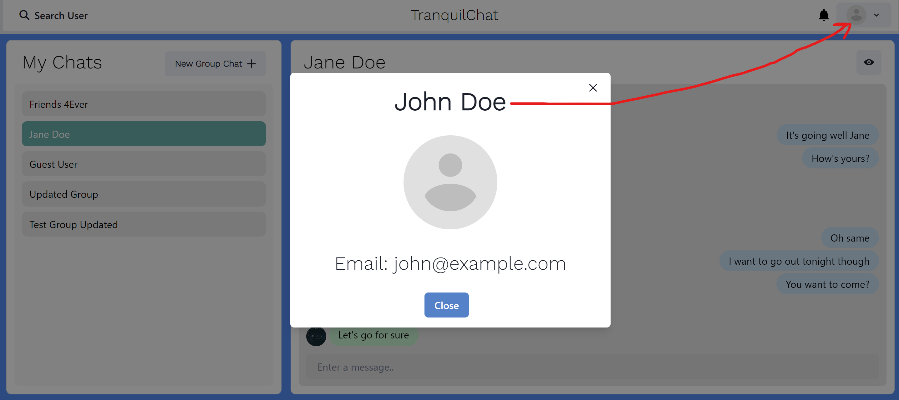

# TranquilChat

A MERN full stack texting app that aims to bring a secure, stress-free texting experience to its users. Uses authentication methods to encrypt and safely transmit user data and incorporates Socket.io for real-time messages and notifications. 

**Client-side** - React JS  
**Server-side** - Express JS and Node JS  
**Database** - Mongo DB  

**Authentication** - Token-based authentication via JSON Web Tokens combined with Bcrypt

**Additional Tools Used** - Chakra UI, Socket.io (WebSockets), Postman, Lottie, Cloudinary, Render

# Features of the App

### Login Page: 

**Note:** You can autofill with the guest credentials by pressing the red button "Get Guest User Credentials" below 

### Sign Up Page:

### One-to-One Chats:

### Group Chats:

### Add/Remove Users From Group Chat

### Real-time Typing Indicators:

### Search Users:

### Notifications:
**Note:** You can click on a notification message regarding a specific chat, and it will take you directly to that chat

### View Other User's Profile:

### Log Out:

